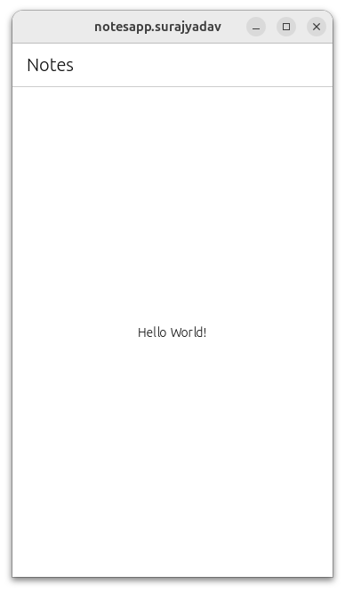
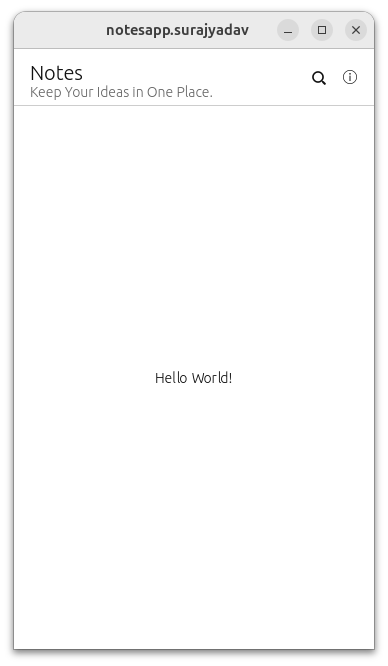
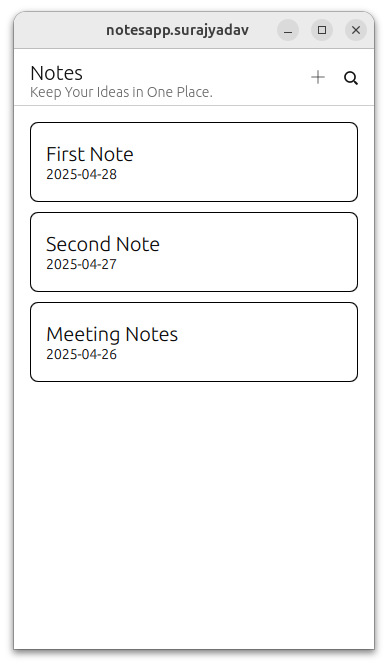

# Note-Keeping App Logbook

# Goals

1. Learn more about app building.
2. Make a Nice Note keeping App.
3. Build a Documentation , that will help develop better learning materials for Future developers.

- Day 1
    <aside>
    💡
    
    > The First Step before starting with a project should be having a clear goal in mind , what you are going to create and what problem it solves. For This App we want to create a basic Notes App, Where we can create, read, update and Delete the Notes.
    > 
    </aside>
    
    <aside>
    ✅
    
    > Researched about the Ubuntu’s Notes App and Listed Down its Features and Things we can create according to Timeline.
    > 
    </aside>
    
    1. The First Goal is to create the UI of our app. For this Create a New Project using clickable create . Fill out the details like a meaningful Project Name like Notes and give a description like A simple Notes-Taking App . 
    2. Then comes the app name. This should consist of lowercase letters only, for instance **`notesapp`,** Then comes your name, also in lowercase letters. After this, you can enter your full name with capitals, as well as your email address.
    - Then you choose the license you want to use to publish your app. You can find more [information about some popular open source licenses](https://opensource.org/licenses)
     on the web site of the Open Source Initiative. After this, enter the 
    current year for the copyright notice (you can just confirm the current 
    year with a press on Enter), and just confirm the default choices for **Git Tag Versioning** and **Save as Default**.
    - Enter the directory the Clickable command created and open the project in Visual Studio Code:
    - `cd notesapp
    code .`
    - Visual Studio Code asks you if you trust the authors of the files in 
    this directory. Confirm with a click on "Yes, I trust the authors" .
    - Try running the project with
        
        ```jsx
        clickable desktop 
        ```
        
        
        
        taskApp1.1
        
    
    > Task 2
    > 
    
    Let’s initialize git in our project for Version Control. This will also help us save and track our progress. 
    
    - First Time Git Initialization process
        
        Here’s a step-by-step guide to help you through the process:
        
        1. **Initialize a new Git repository:**
            
            ```bash
            git init
            
            ```
            
        2. **Check the status of your repository:**
            
            ```bash
            git status
            
            ```
            
        3. **Add all files to the staging area:**
            
            ```bash
            git add .
            
            ```
            
        4. **Commit the changes with a message:**
            
            ```bash
            git commit -m "Initial commit"
            
            ```
            
        5. **Add the remote repository:**
            
            ```bash
            git remote add origin <Remote-Repository-Link>
            
            ```
            
        6. **Push the changes to the remote repository:**
            
            ```bash
            git push -u origin main
            
            ```
            
        
        Make sure to replace `<Remote-Repository-Link>` with the actual URL of your remote repository.
        
    
    > Task 3
    > 
    
    Let’s Create some UI for our app. We will start with the header which is displayed on the top. Its also called the App bar in some other programming languages. In `qml` , we refer to it as `PageHeader`. So if You change the header in the `Page` section it should look like something like this. 
    
    `header: PageHeader {`
    
    `id: header`
    
    `title: i18n.tr('Notes')`
    
    `subtitle: i18n.tr('Keep Your Ideas in One Place.')`
    
    `ActionBar {`
    
    `anchors {`
    
    `top: parent.top`
    
    `right: parent.right`
    
    `topMargin: units.gu(1)`
    
    `rightMargin: units.gu(1)`
    
    `}`
    
    `numberOfSlots: 3`
    
    `actions: [`
    
    `Action {`
    
    `iconName: "search"`
    
    `text: i18n.tr("Search")`
    
    `},`
    
    `Action {`
    
    `iconName: "add"`
    
    `text: i18n.tr("Add Note")`
    
    `onTriggered: {`
    
    `console.log("Add Note button clicked");`
    
    `// TODO: Implement logic to add a new note`
    
    `notesModel.append({`
    
    `title: "New Note",`
    
    `createdAt: Qt.formatDateTime(new Date(), "yyyy-MM-dd")`
    
    `});`
    
    `}`
    
    `}`
    
    `]`
    
    `}`
    
    `}`
    
    
    
    notes1.2
    
     Here we have added the `subtitle` and few clickable icons on the `PageHeader`. 
    
    > Step 4
    > 
    
    Now lets add a `ListView` to our page. You can learn more about `ListViews` [here](https://doc.qt.io/qt-5/qml-qtquick-listview.html#delegate-prop) .
    
    ```jsx
       ListView {
            id: notesListView
            anchors {
                top: header.bottom
                left: parent.left
                right: parent.right
                bottom: parent.bottom // Tip : Its Very important to define the length of the List in the ListView
                topMargin: units.gu(2)
                rightMargin: units.gu(2)
                leftMargin: units.gu(2)
            }
            spacing: 10

            model: notesModel

            delegate: Rectangle {
                width: ListView.view.width
                height: 80
                //color: "white"
                //border.color: "#cccccc"
                border.width: 1
                radius: 8
                anchors.margins: 8

                Column {
                    anchors.verticalCenter: parent.verticalCenter
                    anchors.left: parent.left
                    anchors.leftMargin: 16

                    Text {
                        text: model.title
                        font.pixelSize: 20
                        // font.bold: true
                        //   color: "black"
                    }

                    Text {
                        text: model.createdAt
                        font.pixelSize: 14
                        //  color: "#888888"
                    }
                }

                MouseArea {
                    anchors.fill: parent
                    onClicked: {
                        console.log("Clicked on note:", model.title);
                        // TODO: Navigate to Note Detail View
                    }
                }
            }
        }
    ```


    Add this `ListModel` Code outside the `Page`. 
    
    ```jsx
    ListModel {
        id: notesModel

        ListElement {
            title: "First Note"
            createdAt: "2025-04-28"
        }
        ListElement {
            title: "Second Note"
            createdAt: "2025-04-27"
        }
        ListElement {
            title: "Meeting Notes"
            createdAt: "2025-04-26"
        }
    }
    ```

    Now our app should look like this: 

     
    
    notes1.3
